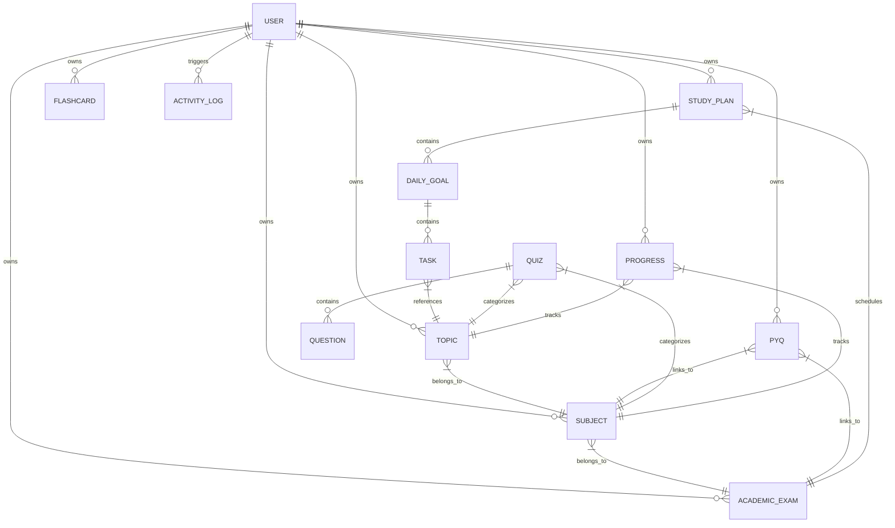

# 🗄️ Database Schemas

**OpenPrep AI** uses **PostgreSQL** as its primary persistent database, interface-managed via the **Sequelize ORM** in Node.js.

---

## 🗺️ Entity Relationship Overview

The relationships between database tables are shown in the following diagram:



---

## 📄 Model Specifications

Here are the detailed schemas for each database model/table:

### 1. User
Represents students, contributors, or admins using the platform.

* **File Location**: [User.js](file:///c:/Users/Nishit/OneDrive/Desktop/ALL%20Projects/OPENPREP%20AI/OpenPrep-AI/backend/models/User.js)
* **Structure**:
```javascript
{
  name: { type: String, required: true },
  email: { type: String, required: true, unique: true, match: regex },
  password: { type: String, required: true, select: false },
  role: { type: String, enum: ['student', 'contributor', 'admin'], default: 'student' },
  streak: {
    count: { type: Number, default: 0 },
    lastActive: { type: Date, default: Date.now }
  },
  studyHours: { type: Number, default: 0 },
  avatar: { type: String, default: '' },
  timestamps: true // adds createdAt, updatedAt
}
```

### 2. Subject
Academic subjects associated with specific exams.

* **File Location**: [Subject.js](file:///c:/Users/Nishit/OneDrive/Desktop/ALL%20Projects/OPENPREP%20AI/OpenPrep-AI/backend/models/Subject.js)
* **Structure**:
```javascript
{
  name: { type: String, required: true, trim: true },
  description: { type: String },
  exam: { type: Schema.Types.ObjectId, ref: 'Exam', required: true },
  user: { type: Schema.Types.ObjectId, ref: 'User', required: true },
  timestamps: true
}
```

### 3. Topic
Discrete study chapters or units belonging to subjects, with user-assigned or AI-assigned confidence ratings.

* **File Location**: [Topic.js](file:///c:/Users/Nishit/OneDrive/Desktop/ALL%20Projects/OPENPREP%20AI/OpenPrep-AI/backend/models/Topic.js)
* **Structure**:
```javascript
{
  name: { type: String, required: true, trim: true },
  description: { type: String },
  subject: { type: Schema.Types.ObjectId, ref: 'Subject', required: true },
  status: { type: String, enum: ['Weak', 'Medium', 'Strong'], default: 'Medium' },
  weightage: { type: Number, default: 0 },
  user: { type: Schema.Types.ObjectId, ref: 'User', required: true },
  timestamps: true
}
```

### 4. PYQ (Previous Year Questions)
Metadata and analytical results derived from uploaded PYQ PDF files.

* **File Location**: [PYQ.js](file:///c:/Users/Nishit/OneDrive/Desktop/ALL%20Projects/OPENPREP%20AI/OpenPrep-AI/backend/models/PYQ.js)
* **Structure**:
```javascript
{
  title: { type: String, required: true },
  exam: { type: Schema.Types.ObjectId, ref: 'Exam', required: true },
  subject: { type: Schema.Types.ObjectId, ref: 'Subject', required: true },
  year: { type: Number, required: true },
  fileUrl: { type: String, required: true },
  analyzed: { type: Boolean, default: false },
  analysisResults: {
    chapterWeightage: [
      { chapterName: String, weightage: Number }
    ],
    importantTopics: [
      { topicName: String, importance: { type: String, enum: ['High', 'Medium', 'Low'] }, frequency: Number }
    ],
    repeatedQuestions: [
      { questionText: String, years: [Number] }
    ],
    trendAnalysis: { type: String }
  },
  user: { type: Schema.Types.ObjectId, ref: 'User', required: true },
  timestamps: true
}
```

### 5. StudyPlan
Active custom planners matching user study schedules.

* **File Location**: [StudyPlan.js](file:///c:/Users/Nishit/OneDrive/Desktop/ALL%20Projects/OPENPREP%20AI/OpenPrep-AI/backend/models/StudyPlan.js)
* **Structure**:
```javascript
{
  exam: { type: Schema.Types.ObjectId, ref: 'Exam', required: true },
  user: { type: Schema.Types.ObjectId, ref: 'User', required: true },
  startDate: { type: Date, required: true },
  endDate: { type: Date, required: true },
  dailyGoals: [
    {
      date: { type: Date, required: true },
      tasks: [
        {
          title: { type: String, required: true },
          completed: { type: Boolean, default: false },
          topic: { type: Schema.Types.ObjectId, ref: 'Topic' },
          duration: { type: Number, default: 60 } // in minutes
        }
      ]
    }
  ],
  status: { type: String, enum: ['active', 'completed', 'archived'], default: 'active' },
  timestamps: true
}
```

### 6. Quiz
MCQ test collections.

* **File Location**: [Quiz.js](file:///c:/Users/Nishit/OneDrive/Desktop/ALL%20Projects/OPENPREP%20AI/OpenPrep-AI/backend/models/Quiz.js)
* **Structure**:
```javascript
{
  title: { type: String, required: true },
  subject: { type: Schema.Types.ObjectId, ref: 'Subject', required: true },
  topic: { type: Schema.Types.ObjectId, ref: 'Topic' },
  questions: [
    {
      questionText: { type: String, required: true },
      options: [{ type: String, required: true }],
      correctAnswer: { type: Number, required: true }, // Index 0-3
      explanation: { type: String }
    }
  ],
  type: { type: String, enum: ['AI_Generated', 'Manual'], default: 'AI_Generated' },
  createdBy: { type: Schema.Types.ObjectId, ref: 'User', required: true },
  timestamps: true
}
```

### 7. Flashcard
Spaced repetition cards containing intervals and quality parameters.

* **File Location**: [Flashcard.js](file:///c:/Users/Nishit/OneDrive/Desktop/ALL%20Projects/OPENPREP%20AI/OpenPrep-AI/backend/models/Flashcard.js)
* **Structure**:
```javascript
{
  user: { type: Schema.Types.ObjectId, ref: 'User', required: true },
  subject: { type: Schema.Types.ObjectId, ref: 'Subject', required: true },
  topic: { type: Schema.Types.ObjectId, ref: 'Topic' },
  front: { type: String, required: true },
  back: { type: String, required: true },
  // Spaced Repetition parameters (SuperMemo SM-2)
  interval: { type: Number, default: 1 }, // in days
  repetitions: { type: Number, default: 0 },
  efactor: { type: Number, default: 2.5 },
  nextReviewDate: { type: Date, default: Date.now },
  timestamps: true
}
```

### 8. Progress
Syllabus progression analytics.

* **File Location**: [Progress.js](file:///c:/Users/Nishit/OneDrive/Desktop/ALL%20Projects/OPENPREP%20AI/OpenPrep-AI/backend/models/Progress.js)
* **Structure**:
```javascript
{
  user: { type: Schema.Types.ObjectId, ref: 'User', required: true },
  subject: { type: Schema.Types.ObjectId, ref: 'Subject', required: true },
  topic: { type: Schema.Types.ObjectId, ref: 'Topic', required: true },
  completionPercentage: { type: Number, default: 0, min: 0, max: 100 },
  studyHours: { type: Number, default: 0 },
  quizScores: [
    {
      attempt: { type: Schema.Types.ObjectId, ref: 'QuizAttempt' },
      score: Number,
      date: { type: Date, default: Date.now }
    }
  ],
  flashcardsMastered: { type: Number, default: 0 },
  timestamps: true
}
```

### 9. ActivityLog
Central audit collection tracking student platform engagements.

* **File Location**: [ActivityLog.js](file:///c:/Users/Nishit/OneDrive/Desktop/ALL%20Projects/OPENPREP%20AI/OpenPrep-AI/backend/models/ActivityLog.js)
* **Structure**:
```javascript
{
  user: { type: Schema.Types.ObjectId, ref: 'User', required: true },
  activityType: { 
    type: String, 
    enum: ['quiz_attempt', 'pyq_upload', 'flashcard_review', 'study_plan_create', 'note_upload'],
    required: true 
  },
  description: { type: String, required: true },
  timestamp: { type: Date, default: Date.now },
  timestamps: true
}
```
